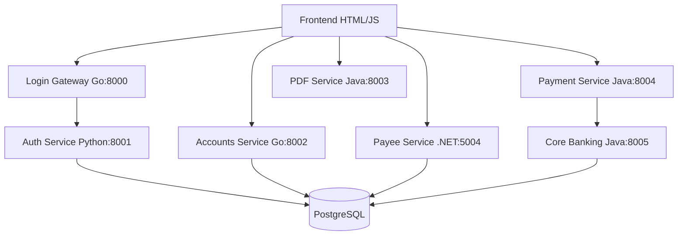

# VuNG Bank API Documentation

## Overview

VuNG Bank is a microservices-based banking application with multiple backend services written in different languages (Go, Python, Java, .NET) and a frontend web application. This document provides comprehensive documentation for all APIs available in the system.

## Architecture Overview

### Service Ports
- **Login Gateway (Go)**: Port 8000
- **Authentication Service (Python)**: Port 8001  
- **Accounts Service (Go)**: Port 8002
- **PDF Receipt Service (Java)**: Port 8003
- **Payment Processing Service (Java)**: Port 8004
- **Core Banking Service (Java)**: Port 8005
- **Payee Store Service (.NET)**: Port 5004
- **Frontend (HTML/JS)**: Port 3001
- **PostgreSQL Database**: Port 5432

### Service Dependencies


---

## 1. Login Gateway Service (Go) - Port 8000

### Base URL: `http://localhost:8000`

#### 1.1 Login
- **Endpoint**: `POST /api/login`
- **Description**: Authenticates user credentials and returns JWT token
- **Headers Required**:
  - `Content-Type: application/json`
  - `Origin: {frontend-origin}`
  - `X-Requested-With: XMLHttpRequest`
  - `X-Api-Client: web-portal`

**Request Body:**
```json
{
  "username": "string",
  "password": "string",
  "force_login": false
}
```

**Success Response (200):**
```json
{
  "token": "JWT_TOKEN_STRING",
  "user": {
    "id": "string",
    "username": "string", 
    "roles": ["retail", "corporate"]
  }
}
```

**Session Conflict Response (409):**
```json
{
  "session_conflict": true,
  "existing_session": {
    "created_at": "2023-01-01T10:00:00Z",
    "ip_address": "192.168.1.1",
    "user_agent": "Browser/Version"
  }
}
```

**Error Responses:**
- `400`: Invalid request body or headers
- `401`: Invalid credentials
- `403`: Insufficient permissions (no retail/corporate role)
- `500`: Authentication service unavailable

#### 1.2 Logout
- **Endpoint**: `POST /api/logout`
- **Description**: Terminates user session
- **Headers Required**: Same as login

**Request Body:**
```json
{
  "user_id": "string",
  "session_id": "string (optional)",
  "terminate_all_sessions": false
}
```

**Success Response (200):**
```json
{
  "success": true,
  "message": "Logout successful",
  "sessions_terminated": 1
}
```

#### 1.3 Health Check
- **Endpoint**: `GET /api/health`
- **Description**: Service health status

**Response:**
```json
{
  "status": "healthy",
  "services": {
    "auth_service": true
  },
  "timestamp": "2023-01-01T10:00:00Z"
}
```

---

## 2. Authentication Service (Python) - Port 8001

### Base URL: `http://localhost:8001`

#### 2.1 Verify Credentials
- **Endpoint**: `POST /verify`
- **Description**: Internal service for credential verification
- **Headers**: 
  - `X-Request-Id: string`
  - `X-Forwarded-For: string`
  - `User-Agent: string`

**Request Body:**
```json
{
  "username": "string",
  "password": "string",
  "force_login": false
}
```

**Response:**
```json
{
  "ok": true,
  "userId": "string",
  "roles": ["retail", "corporate"],
  "session_conflict": false,
  "existing_session": {},
  "session_id": "uuid"
}
```

#### 2.2 Create Session
- **Endpoint**: `POST /create-session`
- **Description**: Creates active session record

**Request Body:**
```json
{
  "user_id": 1,
  "session_id": "uuid",
  "jwt_token": "string",
  "ip_address": "string",
  "user_agent": "string"
}
```

#### 2.3 Validate Session
- **Endpoint**: `POST /validate-session`
- **Description**: Validates active session and JWT

**Request Body:**
```json
{
  "session_id": "uuid",
  "jwt_token": "string"
}
```

**Response:**
```json
{
  "valid": true,
  "user_id": 1,
  "reason": "string (if invalid)"
}
```

#### 2.4 Logout
- **Endpoint**: `POST /logout`
- **Description**: Terminates sessions

**Request Body:**
```json
{
  "user_id": 1,
  "session_id": "uuid (optional)",
  "terminate_all_sessions": false
}
```

#### 2.5 Health Check
- **Endpoint**: `GET /health`

**Response:**
```json
{
  "status": "healthy",
  "database": "connected",
  "startup_cleanup_done": true
}
```

---

## 3. Accounts Service (Go) - Port 8002

### Base URL: `http://localhost:8002`

#### 3.1 Get User Accounts
- **Endpoint**: `GET /internal/accounts`
- **Description**: Retrieves user accounts and recent transactions
- **Authentication**: JWT Bearer token required
- **Headers**: 
  - `Authorization: Bearer {token}`

**Response:**
```json
{
  "userId": "string",
  "accounts": [
    {
      "id": 1,
      "accountNumber": "ACC001",
      "accountName": "Savings Account",
      "accountType": "savings",
      "balance": 5000.00,
      "currency": "USD",
      "status": "active"
    }
  ],
  "recentTransactions": [
    {
      "id": 1,
      "transactionType": "debit",
      "amount": -100.00,
      "description": "ATM Withdrawal",
      "referenceNumber": "REF001",
      "transactionDate": "2023-01-01T10:00:00Z",
      "balanceAfter": 4900.00,
      "status": "completed"
    }
  ]
}
```

#### 3.2 Update Account Balance
- **Endpoint**: `POST /internal/accounts/update-balance`
- **Description**: Internal service for balance updates
- **Authentication**: JWT Bearer token required

**Request Body:**
```json
{
  "accountNumber": "string",
  "amount": -100.50,
  "transactionType": "debit",
  "referenceNumber": "string",
  "description": "string"
}
```

**Response:**
```json
{
  "success": true,
  "accountNumber": "string",
  "oldBalance": 5000.00,
  "newBalance": 4899.50,
  "transactionId": 123,
  "message": "string"
}
```

#### 3.3 Create Transaction Record
- **Endpoint**: `POST /internal/accounts/create-transaction`
- **Description**: Creates transaction record
- **Authentication**: JWT Bearer token required

**Request Body:**
```json
{
  "accountNumber": "string",
  "transactionType": "credit",
  "amount": 500.00,
  "description": "string",
  "referenceNumber": "string",
  "balanceAfter": 5500.00,
  "status": "completed"
}
```

**Response:**
```json
{
  "success": true,
  "transactionId": 124,
  "accountNumber": "string",
  "message": "Transaction record created successfully"
}
```

#### 3.4 Health Check
- **Endpoint**: `GET /health`

**Response:**
```json
{
  "status": "healthy",
  "service": "accounts-go-service",
  "database": true,
  "timestamp": "2023-01-01T10:00:00Z"
}
```

---

## 4. Payment Processing Service (Java) - Port 8004

### Base URL: `http://localhost:8004`

#### 4.1 Create Payment Transfer
- **Endpoint**: `POST /payments/transfer`
- **Description**: Initiates fund transfer payment
- **Content-Type**: `application/xml`
- **Headers Required**:
  - `X-Api-Client: web-portal`
  - `X-Request-Id: string`
  - `Content-Type: application/xml`
  - `X-Signature: string`
  - `Authorization: Bearer {token}`

**Request Body (XML):**
```xml
<?xml version="1.0" encoding="UTF-8"?>
<PaymentRequest>
    <FromAccountNo>ACC001</FromAccountNo>
    <ToAccountNo>ACC002</ToAccountNo>
    <Amount>1000.00</Amount>
    <Currency>USD</Currency>
    <Description>Fund Transfer</Description>
    <PayeeName>John Doe</PayeeName>
    <IfscCode>BANK001</IfscCode>
    <TransferType>IMPS</TransferType>
</PaymentRequest>
```

**Success Response (202):**
```json
{
  "txnRef": "uuid",
  "status": "IN_PROGRESS"
}
```

**Error Responses:**
```json
{
  "txnRef": null,
  "status": "FAILED", 
  "reason": "INSUFFICIENT_BALANCE"
}
```

#### 4.2 Get Payment Status
- **Endpoint**: `GET /payments/status/{txnRef}`
- **Description**: Retrieves payment transaction status

**Response:**
```json
{
  "txnRef": "uuid",
  "status": "SUCCESS",
  "cbsId": "CBS123",
  "approvedAt": "2023-01-01T10:05:00Z"
}
```

**Status Values:**
- `RECEIVED`: Payment received
- `VALIDATED`: Basic validation passed
- `IN_PROGRESS`: Processing with CoreBanking
- `SUCCESS`: Payment completed successfully
- `FAILED`: Payment failed

#### 4.3 Health Check
- **Endpoint**: `GET /payments/health`

**Response:**
```json
{
  "status": "healthy",
  "service": "vubank-payment-service",
  "timestamp": "2023-01-01T10:00:00Z",
  "version": "1.0.0",
  "memory": {
    "used": "256 MB",
    "free": "768 MB",
    "total": "1024 MB",
    "max": "2048 MB"
  },
  "dependencies": {
    "hazelcast": "healthy",
    "corebanking": "healthy"
  }
}
```

---

## 5. Core Banking Service (Java) - Port 8005

### Base URL: `http://localhost:8005`

#### 5.1 Process Payment
- **Endpoint**: `POST /core/payments`
- **Description**: Core banking payment processing (internal service)
- **Content-Type**: `application/json`
- **Headers**:
  - `X-Request-Id: string`
  - `X-Origin-Service: payment-process`
  - `X-Txn-Ref: string`
  - `Authorization: Bearer {token}`

**Request Body:**
```json
{
  "fromAccountNo": "string",
  "toAccountNo": "string", 
  "amount": 1000.00,
  "currency": "USD",
  "description": "string",
  "payeeName": "string",
  "ifscCode": "string",
  "transferType": "IMPS"
}
```

**Response:**
```json
{
  "status": "APPROVED",
  "txnRef": "uuid",
  "cbsId": "CBS123456",
  "approvedAt": "2023-01-01T10:05:30Z"
}
```

**Rejection Response:**
```json
{
  "status": "REJECTED",
  "txnRef": "uuid", 
  "reason": "INSUFFICIENT_FUNDS"
}
```

#### 5.2 Get Payment Status by CBS ID
- **Endpoint**: `GET /core/payments/{cbsId}`
- **Description**: Optional status lookup (not implemented)

#### 5.3 Health Check
- **Endpoint**: `GET /core/health`

---

## 6. Payee Store Service (.NET) - Port 5004

### Base URL: `http://localhost:5004`

#### 6.1 Get User Payees
- **Endpoint**: `GET /api/payees`
- **Description**: Retrieves all payees for authenticated user
- **Authentication**: JWT Bearer token required

**Response:**
```json
[
  {
    "id": 1,
    "payeeName": "John Doe",
    "beneficiaryName": "John Doe",
    "accountNumber": "1234567890",
    "ifscCode": "BANK001234",
    "accountType": "savings",
    "bankName": "Example Bank",
    "branchName": "Main Branch",
    "isVerified": true
  }
]
```

#### 6.2 Get Payee by ID
- **Endpoint**: `GET /api/payees/{id}`
- **Description**: Retrieves specific payee by ID
- **Authentication**: JWT Bearer token required

#### 6.3 Add New Payee
- **Endpoint**: `POST /api/payees`
- **Description**: Adds new payee for user
- **Authentication**: JWT Bearer token required

**Request Body:**
```json
{
  "payeeName": "Jane Smith",
  "beneficiaryName": "Jane Smith",
  "accountNumber": "9876543210", 
  "ifscCode": "BANK005678",
  "accountType": "current"
}
```

**Response (201):**
```json
{
  "id": 2,
  "payeeName": "Jane Smith",
  "beneficiaryName": "Jane Smith", 
  "accountNumber": "9876543210",
  "ifscCode": "BANK005678",
  "accountType": "current",
  "bankName": "Auto-resolved Bank Name",
  "branchName": "Auto-resolved Branch",
  "isVerified": false
}
```

#### 6.4 Delete Payee
- **Endpoint**: `DELETE /api/payees/{id}`
- **Description**: Removes payee from user's list
- **Authentication**: JWT Bearer token required

**Response:**
```json
{
  "message": "Payee deleted successfully"
}
```

#### 6.5 Check Payee Exists
- **Endpoint**: `POST /api/payees/exists`
- **Description**: Checks if payee already exists for user
- **Authentication**: JWT Bearer token required

**Request Body:**
```json
{
  "accountNumber": "1234567890",
  "ifscCode": "BANK001234"
}
```

**Response:**
```json
{
  "exists": true
}
```

#### 6.6 Health Check
- **Endpoint**: `GET /api/health`

**Response:**
```json
{
  "status": "healthy",
  "service": "vubank-payee-service",
  "timestamp": "2023-01-01T10:00:00.000Z",
  "version": "1.0.0",
  "environment": "Production",
  "uptime": "1d 5h 30m 45s",
  "memory": {
    "workingSet": "128.5 MB",
    "privateMemory": "135.2 MB",
    "gcMemory": "89.3 MB",
    "maxWorkingSet": "256.0 MB"
  },
  "dependencies": {
    "database": "healthy"
  }
}
```

---

## 7. PDF Receipt Service (Java) - Port 8003

### Base URL: `http://localhost:8003`

#### 7.1 Generate Receipt PDF
- **Endpoint**: `POST /api/pdf/generate-receipt`
- **Description**: Generates PDF receipt for transaction

**Request Body:**
```json
{
  "transactionId": "string",
  "fromAccount": "string",
  "toAccount": "string",
  "amount": 1000.00,
  "currency": "USD",
  "description": "string",
  "transactionDate": "2023-01-01T10:00:00Z",
  "referenceNumber": "string",
  "status": "SUCCESS"
}
```

**Response:**
- **Content-Type**: `application/pdf`
- **Headers**: 
  - `Content-Disposition: attachment; filename="VuBank_Receipt_TXN123_20230101_100000.pdf"`
- **Body**: PDF file bytes

#### 7.2 Health Check
- **Endpoint**: `GET /api/pdf/health`

---

## 8. Frontend API Integration

### 8.1 API Base URLs Used by Frontend

```javascript
const API_ENDPOINTS = {
  LOGIN: 'http://localhost:8000/api/login',
  LOGOUT: 'http://localhost:8000/api/logout', 
  ACCOUNTS: 'http://localhost:8002/internal/accounts',
  PAYEES: 'http://localhost:5004/api/payees',
  PAYMENTS: 'http://localhost:8004/payments/transfer',
  PDF_RECEIPT: 'http://localhost:8003/api/pdf/generate-receipt'
};
```

### 8.2 Common Headers Used by Frontend

```javascript
const COMMON_HEADERS = {
  'Content-Type': 'application/json',
  'Origin': window.location.origin,
  'X-Requested-With': 'XMLHttpRequest',
  'X-Api-Client': 'web-portal',
  'Authorization': `Bearer ${token}` // When authenticated
};
```

### 8.3 Authentication Flow

1. **Login**: `POST /api/login` → Store JWT token
2. **Access Protected Resources**: Include `Authorization: Bearer {token}`
3. **Session Conflict**: Handle 409 response, show force login dialog
4. **Logout**: `POST /api/logout` → Clear stored token

### 8.4 Error Handling Patterns

```javascript
try {
  const response = await fetch(url, options);
  
  if (response.status === 409) {
    // Handle session conflict
    handleSessionConflict(await response.json());
    return;
  }
  
  if (!response.ok) {
    throw new Error(`HTTP ${response.status}`);
  }
  
  const data = await response.json();
  // Handle success
} catch (error) {
  // Handle network/parsing errors
}
```

---

## 9. Transaction Flow Examples

### 9.1 Complete Login Flow

1. **Frontend** → `POST /api/login` → **Login Gateway**
2. **Login Gateway** → `POST /verify` → **Auth Service** 
3. **Auth Service** → Validate credentials in **Database**
4. **Auth Service** → Return user data → **Login Gateway**
5. **Login Gateway** → Generate JWT → **Frontend**
6. **Login Gateway** → `POST /create-session` → **Auth Service**

### 9.2 Fund Transfer Flow

1. **Frontend** → `GET /internal/accounts` → **Accounts Service** (Load accounts)
2. **Frontend** → `GET /api/payees` → **Payee Service** (Load payees)
3. **Frontend** → `POST /payments/transfer` (XML) → **Payment Service**
4. **Payment Service** → Parse XML, validate, create transaction state
5. **Payment Service** → `POST /core/payments` → **Core Banking Service**
6. **Core Banking Service** → Process payment (1.5s simulation)
7. **Core Banking Service** → Return result → **Payment Service**
8. **Payment Service** → Update transaction state
9. **Frontend** → `GET /payments/status/{txnRef}` → **Payment Service** (Check status)
10. **Frontend** → `POST /api/pdf/generate-receipt` → **PDF Service** (Generate receipt)

### 9.3 Account Dashboard Load Flow

1. **Frontend** → Verify JWT token exists
2. **Frontend** → `GET /internal/accounts` → **Accounts Service**
3. **Accounts Service** → Query user accounts and transactions from **Database**
4. **Accounts Service** → Return account data → **Frontend**
5. **Frontend** → Render dashboard with account information

---

## 10. Security Considerations

### 10.1 Authentication
- JWT tokens with 15-minute expiration
- Session management with conflict detection
- Role-based access control (retail/corporate)

### 10.2 Headers Validation
- Required headers: `X-Api-Client`, `X-Requested-With`, `Origin`
- CORS enabled for all services
- Distributed tracing headers supported

### 10.3 Data Protection
- Passwords hashed with bcrypt
- JWT tokens hashed for session storage
- No sensitive data in logs

---

## 11. Development & Testing

### 11.1 Test Credentials

```
Username: johndoe | Password: password123 (Retail)
Username: janedoe | Password: password123 (Retail)  
Username: corpuser | Password: password123 (Corporate)
```

### 11.2 Service Health Monitoring

All services provide health check endpoints:
- Login Gateway: `GET /api/health`
- Auth Service: `GET /health`
- Accounts Service: `GET /health`
- Payment Service: `GET /payments/health`
- Core Banking: `GET /core/health`
- Payee Service: `GET /api/health`
- PDF Service: `GET /api/pdf/health`

### 11.3 APM Integration

All services are instrumented with Elastic APM:
- Distributed tracing across services
- Performance monitoring
- Error tracking
- Real User Monitoring (RUM) in frontend

---

## 12. Database Schema Overview

### Core Tables:
- **users**: User accounts and credentials
- **roles**: User role definitions
- **user_roles**: User-role associations  
- **accounts**: Bank account information
- **transactions**: Transaction records
- **payees**: Saved payee information
- **active_sessions**: Session management
- **login_requests**: Authentication audit log

---

This documentation covers all APIs implemented in the VuNG Bank system. Each service provides specific functionality while working together to deliver a complete banking experience.